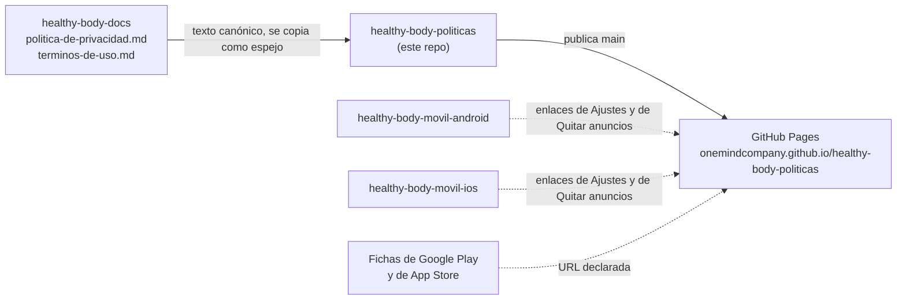

# healthy-body-politicas

Términos de uso y política de privacidad **públicos** del sistema **Healthy Body**, servidos con GitHub
Pages:

> - **https://onemindcompany.github.io/healthy-body-politicas/privacidad**
> - **https://onemindcompany.github.io/healthy-body-politicas/terminos**

Son las URLs que abren las apps desde Ajustes y desde la pantalla de la suscripción (RN-01-09 de
`healthy-body-docs`), y las que se declaran en las fichas de Google Play y de App Store, que exigen
páginas accesibles sin iniciar sesión.

## Fuente de verdad

El texto canónico vive en `healthy-body-docs` (repo privado): `politica-de-privacidad.md` y
`terminos-de-uso.md`. **Los cambios se hacen allá primero** y estas páginas se actualizan como
espejo, en el mismo trabajo. La versión en inglés existe solo aquí, debajo de la española en cada
página. Si divergen, la declaración pública deja de coincidir con la interna, y eso es un problema
legal.

| Archivo | Contenido |
|---|---|
| `index.html` | Portada con los dos enlaces. |
| `privacidad.html` | Política de privacidad, en español y en inglés. GitHub Pages la sirve en `/privacidad`. |
| `terminos.html` | Términos de uso, en español y en inglés. GitHub Pages los sirve en `/terminos`. |
| `.nojekyll` | Sirve los archivos tal cual, sin procesarlos con Jekyll. |

## Desviaciones del estándar de repositorios

Dos, deliberadas y acotadas (`repositorios-onemind`), igual que en `suscripcion-politicas`:

1. **Es público**: su única razón de existir es que las tiendas y los usuarios puedan leerlo. No
   contiene código de producto.
2. **El commit inicial incluye las páginas**, no solo el README: GitHub Pages sirve desde `main`, y
   un repo de políticas sin políticas no publica nada.

## Ramas (estándar OneMind)

| Rama | Rol | Protegida |
|------|-----|-----------|
| `main` | Producción / versión publicada | ✅ |
| `qa` | Validación | ✅ |
| `develop` | Integración del trabajo en curso | ✅ |
| `feature/*` | Trabajo puntual, se integra a `develop` vía PR | ❌ |

Las tres ramas protegidas exigen pull request y bloquean borrado y `force-push`. Como Pages sirve
desde `main`, un cambio de política no está publicado hasta que llega a `main` por el flujo normal.

## Dependencias

